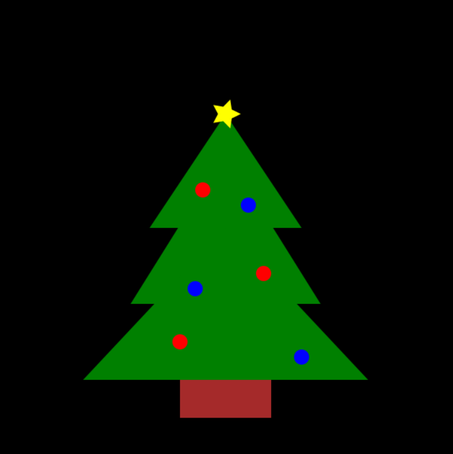

# christmas_scene
A simple Christmas tree drawn using Luxor.jl

The ```tri()``` function draws triangles based on their 
desired starting point, base length, and height.

```tri()``` is used to create three seperate green triangles that 
form the branches of the tree.

For ornaments, ```circle()``` is used with color and placed about the branches.

The stump is just a brown ```rect()```

The yellow ```star()``` has a ```circle()``` with its opacity set to 0.5 
to create a glowing effect.




